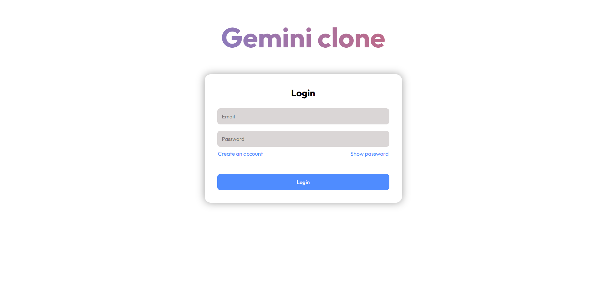
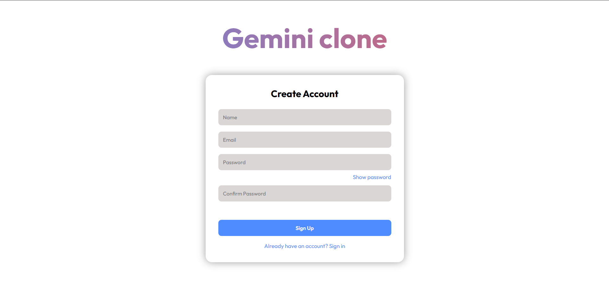
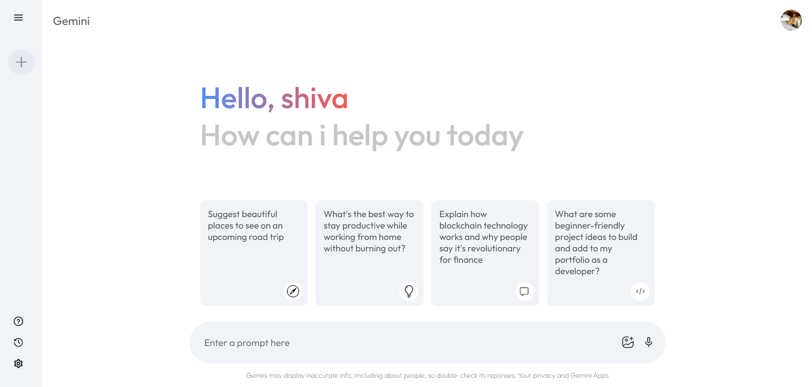
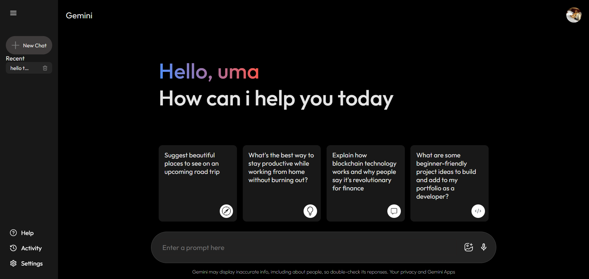
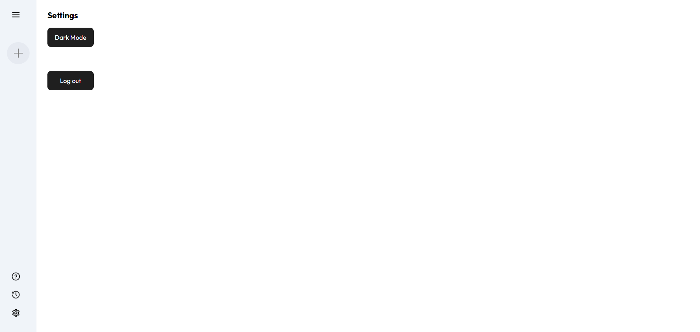

# Gemini Clone 🤖✨
=======
# 🔗 Live Demo
👉 [View Live Demo](https://gemini-clone-mvbkffqzu-jimitts-projects.vercel.app/)
>>>>>>> 6e4ef0e033cc5d5e334d0ca1140885be513ff7ba

A full-stack **Gemini-inspired AI chat application** built to demonstrate modern frontend, backend, authentication, and database integration practices.

🔗 **Live Demo**:  
https://gemini-clone-mvbkffqzu-jimitts-projects.vercel.app/

---

## 📸 Screenshots

### 🔐 Authentication
**Login Page**


**Create Account**


---

### 💬 Chat Interface

**Light Mode**


**Dark Mode**

---

### ⚙️ Settings
**Theme Toggle & Logout**


---

## 🚀 Features

- User Authentication (Signup & Login)
- JWT-based secure sessions
- Chat interface inspired by Google Gemini
- Persistent chat history
- Light / Dark mode toggle
- Responsive UI
- Deployed full-stack app (Frontend + Backend)

---

## 🛠 Tech Stack

### Frontend
- React
- Vite
- CSS / Tailwind (if used)
- Deployed on **Vercel**

### Backend
- Node.js
- Express.js
- JWT Authentication
- bcrypt for password hashing
- Deployed on **Render**

### Database
- PostgreSQL
- Hosted on **Neon DB**

---

## 🗄 Database Schema

- **users**
  - id
  - name
  - email (unique)
  - password (hashed)
  - theme
  - created_at

- **chats**
  - id
  - user_id (FK)
  - title
  - created_at

- **messages**
  - id
  - chat_id (FK)
  - sender
  - content
  - created_at

---

## 🔐 Environment Variables

Backend requires the following environment variables:

```env
DATABASE_URL=your_neon_database_url
JWT_SECRET=your_jwt_secret

# Clone repository
git clone https://github.com/your-username/gemini-clone.git

# Install backend dependencies
cd server
npm install

# Install frontend dependencies
cd ../client/gemini-clone
npm install


<!-- Run locally -->

# Backend
npm run dev

# Frontend
npm run dev


<!-- 🎯 Why this project? -->
* This project was built to:

* Demonstrate full-stack development skills

* Show real-world debugging & deployment experience

* Practice secure authentication flows

* Work with cloud PostgreSQL (Neon)

* Deploy production-ready apps


<!-- 📌 Notes -->
* Signup may fail if the email already exists (unique constraint).

* Authentication is required for chat access.

* Built primarily as a portfolio & interview project.

🙌 Author

Built by [Jimitt Popat]
Feel free to reach out for collaboration or feedback!
